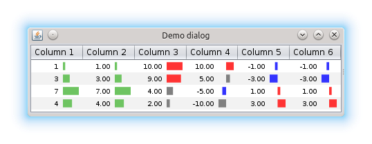

JSparklines Factory []()
========================

A project that eases the creation of [JSparkLines](https://github.com/compomics/jsparklines) renderers. 

Please, note that currently only `JSparklinesBarChartTableCellRenderer` has support in this project.

Motivation
----------
When displaying single numeric values in a column the simplest option is to use the `JSparklinesBarChartTableCellRenderer`. It is neccessary to explicitly indicate the maximum (and minimum, if desired) values of the renderer. For instance:

```java
aTable.getColumn(0).setCellRenderer(
    new JSparklinesBarChartTableCellRenderer(
        PlotOrientation.HORIZONTAL,             // orientation of the plot
        -5.0,                                   // lower range for the plot
        5.0,                                    // upper range for the plot
        negativeColor,                          // color to use for the negative values
        positiveColor                           // color to use for the positive values
    )
);
```

However, some users may be interested in creating a renderer that automatically computes the maximum (and minimum) values of the given column and uses them to properly create the renderers. This project provides different methods to achieve this by using constructors and builders. For instance, the following invocation does this and automatically establishes the renderer for the given column, using default value for plot orientation (which usually is `PlotOrientation.HORIZONTAL`).
```java
JSparklinesBarChartTableCellRendererFactory.createMaxMinValuesBarChartRenderer(table, 0)
```

Moreover, builders are also provided to create renderers in the following way:
```java
JSparklinesBarChartTableCellRendererBuilderFactory
    .newMaximumMinimumColoredBarChartRenderer(table, 0)
	    .withPositiveValuesColor(Color.BLUE)
	    .withNegativeValuesColor(Color.RED)
    .build()
```

Using JSparklines Factory
-------------------------
Clone this project and install it using `mvn install` or add the following repository and dependency declarations to your `pom.xml`:
```xml
    <repositories>
		<repository>
			<id>sing-repository</id>
			<name>SING repository</name>
			<url>http://maven.sing-group.org/repository/maven/</url>
		</repository>
	</repositories>
	
	<dependencies>
    	<dependency>
			<groupId>org.sing_group</groupId>
			<artifactId>jsparklines-factory</artifactId>
			<version>0.1.0-SNAPSHOT</version>
		</dependency>
	</dependencies>
```

Examples
--------
Two demo clases (`JSparklinesBarChartTableCellRendererBuilderDemo` and `JSparklinesBarChartTableCellRendererFactoryDemo`) are provided within different examples that configure the a table as shown in the following image.

